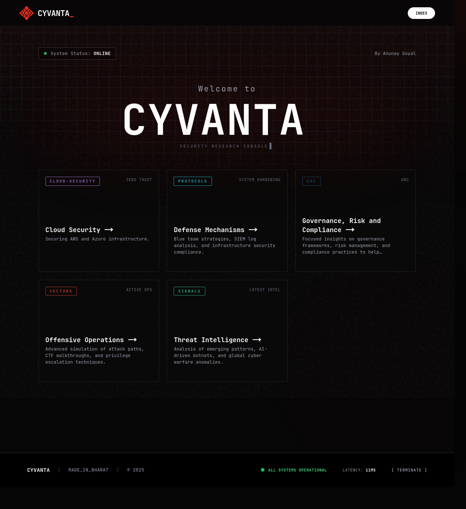
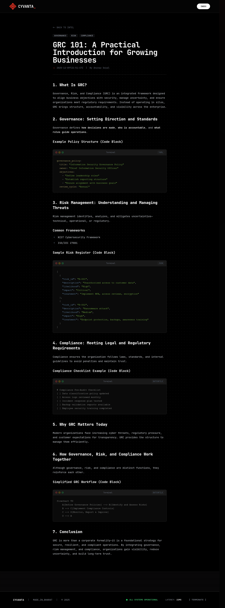

# Cyvanta - Advanced Security Research Blog

A high-performance, aesthetically driven cybersecurity blog built with Next.js 16, Tailwind CSS, and Sanity CMS.

## Snapshots

### Home Page



### Blog Post



## Key Features

### 1. Immersive "Hacker" Aesthetic

- **Typography**: Global usage of [JetBrains Mono](https://www.jetbrains.com/lp/mono/) for a true developer-centric feel.
- **Visuals**: Enhanced Navbar with a prominent, red-accented logo and a "Magnetic Particle Field" background that reacts to cursor movement.
- **Design System**: Custom dark mode with "zinc" and "emerald" accents, scanline animations, and terminal-style typography. Refined light mode with solid colors and improved contrast.
- **Micro-interactions**: Hover effects, glowing borders, and dynamic grid backgrounds.
- **Responsive**: Fully optimized layouts for mobile, tablet, and desktop.

### 2. Powerful Content Management (Sanity Studio)

- **Universal Live Preview**: A consistently accurate real-time preview for **Posts**, **Categories**, **Authors**, and **Tags**.
- **Split-Pane Editing**: Edit content on the left, see the result on the right instantly.
- **Category Card Preview**: A dedicated view to visualize exactly how categories appear in the website grid layout.
- **Hex Color Standardization**: All tags and categories use a centralized Hex color palette, ensuring absolute visual consistency between the Studio and the Website.

### 3. Modern Tech Stack

- **Framework**: Next.js 16 (App Router)
- **Core**: React 19
- **CMS**: Sanity (v3) with Visual Editing support
- **Styling**: Tailwind CSS + Framer Motion
- **Performance**: Optimized font loading, image handling, and static generation.

### 4. Enhanced Author Profiles

- **Dedicated Author Pages**: Dynamic `/author/[slug]` routes displaying author bio, social links, and a grid of their posts.
- **Rich Schema**: Extended Sanity schema to include detailed author information, avatars, and social media presence (GitHub, X, LinkedIn, etc.).
- **Smart Integration**: Authors are automatically linked to their posts, creating a seamless navigation experience.

## Using this Project

This project is open-source and designed to be easily forked and customized. You can "cache" (download) the code to use as a starting point for your own blog.

### Quick Start (Fork & Run)

1.  **Clone the Repository**:

    ```bash
    git clone https://github.com/AnunayGoyal/cyvanta-blog.git
    cd cyvanta-blog
    ```

2.  **Install Dependencies**:

    ```bash
    npm install
    ```

3.  **Environment Setup**:
    Create a `.env.local` file in the root directory. You will need a Sanity project ID and dataset.

    ```env
    NEXT_PUBLIC_SANITY_PROJECT_ID=your_project_id
    NEXT_PUBLIC_SANITY_DATASET=production
    ```

4.  **Run Development Server**:

    ```bash
    npm run dev
    ```

5.  **Access the App**:
    - Website: `http://localhost:3000`
    - Studio: `http://localhost:3000/studio`

### Customization

- **Colors**: Edit `tailwind.config.ts` to change the `zinc` and `emerald` color palettes.
- **Content**: Go to `/sanity/schemaTypes` to modify the content models.
- **Aesthetics**: Check `app/globals.css` for base styles and scanline effects.

---

## Docker Support

This application is container-ready with a multi-stage Dockerfile optimized for production performance.

### Running with Docker Compose (Recommended)

The easiest way to run the application is using Docker Compose, which handles the build and network setup for you.

```bash
docker-compose up --build
```

This will start the application on port 3000.

### Manual Docker Build

If you prefer to build the image manually:

1.  **Build the Image**:

    ```bash
    docker build -t cyvanta-app .
    ```

2.  **Run the Container**:
    ```bash
    docker run -p 3000:3000 cyvanta-app
    ```

## Project Structure

- `/app`: Next.js App Router pages (Website, Studio, & Author Profiles).
- `/components`: Reusable UI components (Navbar, Footer, Hero, etc.).
- `/lib`: Utilities (Sanity queries, color helpers, etc.).
- `/sanity`: Schema definitions and Studio configuration.
- `/public`: Static assets (images, fonts).
